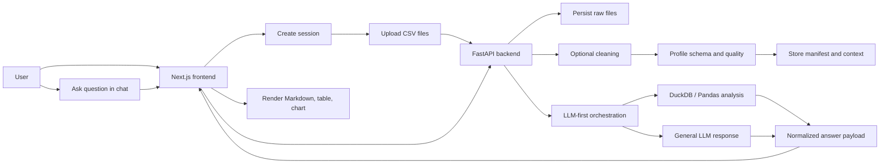

# Multi-CSV Chat Analytics

Multi-CSV Chat Analytics is a full-stack application for uploading several CSV files in a single session, cleaning and profiling them, and asking natural-language questions across the uploaded data. The UI renders answers as Markdown, tables, and charts, while the backend keeps each session isolated on disk and uses a hybrid LLM + deterministic analytics pipeline to produce data-backed answers.

## Problem Statement

The assignment behind this repository is to build an application that can work with more than one CSV at a time and answer questions in a conversational way. The core user need is simple:

- upload multiple related CSV files
- inspect the data quality before analysis
- ask questions across the full dataset set
- get an answer that is clear, traceable, and visually useful when needed

Examples of the kinds of questions the system is expected to support:

- What is the total revenue for the past year?
- Show me a sales trend over the last 6 months.
- Compare orders and order_items.
- Group all duplicate files as pairs.

The application therefore has to do more than file upload. It has to coordinate session management, cleaning, profiling, join-aware analysis, response formatting, and frontend rendering without losing the link back to the source data.

## What This Repository Implements

This repo contains a working implementation of that workflow with the following core properties:

- multiple CSV files can be uploaded into one session
- uploaded files are stored in a session-scoped filesystem layout
- optional cleaning runs before profiling and analysis
- schema and quality metadata are generated per file
- chat requests are routed through an LLM-first orchestration path
- chart contracts are normalized before the frontend sees them
- the frontend renders Markdown, tables, and charts in the same response stream

The current implementation is intentionally lightweight in infrastructure. It uses FastAPI, Pandas, and DuckDB on the backend, and Next.js, React, and Recharts on the frontend. Session state is persisted on disk rather than in PostgreSQL or Redis.

## How The System Works

### End-to-End Flow

1. The frontend opens a session.
2. The user uploads one or more CSV files.
3. The backend stores the raw files in a session directory.
4. If cleaning is enabled, the backend writes cleaned copies into the processed directory.
5. The backend profiles each file and stores schema and quality metadata.
6. The user submits a question in the chat panel.
7. The backend prefers the agentic / LLM path first, then falls back to the general LLM response path.
8. The response contract is normalized into text, optional table preview, optional chart spec, and provenance metadata.
9. The frontend renders the answer as Markdown and shows any table/chart output inline.

### Request Lifecycle



### Data Flow

The data path is session-based and filesystem-backed:

- `data/raw/{session_id}` contains uploaded source CSVs
- `data/processed/{session_id}` contains cleaned outputs when cleaning is enabled
- `data/profiles/{session_id}` contains manifest, profiling metadata, and chat context

This design keeps each session isolated, makes local development easy, and avoids cross-session contamination.

### Response Flow

The backend response contract is designed for mixed output. A single chat call may return:

- narrative answer text
- a tabular preview of rows used to support the answer
- a chart specification when the question is visual in nature
- provenance metadata so the result is explainable

The frontend treats these pieces independently so a response can be text-only, text-plus-table, text-plus-chart, or all of them together.

## Detailed Architecture

### 1. Frontend Layer

The frontend is a Next.js app built with React and TypeScript. Its responsibility is not to reason about the data; its responsibility is to present upload, chat, and output states clearly.

What the frontend does:

- creates and tracks the current session
- uploads multiple CSV files
- shows upload progress and session state
- renders chat history
- renders assistant messages as Markdown
- renders tables for structured output
- renders charts for analytical output
- exposes cleaning / quality details inline

Key frontend files:

- [frontend/src/app/page.tsx](frontend/src/app/page.tsx)
- [frontend/src/app/app.css](frontend/src/app/app.css)
- [frontend/src/services/api.ts](frontend/src/services/api.ts)
- [frontend/src/components/chat-chart.tsx](frontend/src/components/chat-chart.tsx)
- [frontend/src/types/api.ts](frontend/src/types/api.ts)

Important frontend behavior:

- assistant output is rendered through ReactMarkdown
- GitHub-flavored Markdown tables are supported through remark-gfm
- answer tables are normalized to avoid `[object Object]` rendering issues
- chart rendering is delegated to a dedicated chart component
- the cleaning details UI is compact and inline with upload metadata

### 2. Backend API Layer

The backend is a FastAPI service exposing session, upload, schema, quality, and chat endpoints. It owns the authoritative data flow.

What the backend does:

- creates a session and its directory structure
- accepts multiple CSV uploads
- optionally cleans each CSV
- profiles each CSV and records quality signals
- persists manifest and chat context
- runs chat orchestration and query planning
- normalizes chart and table response shapes for the frontend

Key backend files:

- [backend/app/main.py](backend/app/main.py)
- [backend/app/api/routes_sessions.py](backend/app/api/routes_sessions.py)
- [backend/app/schemas/chat.py](backend/app/schemas/chat.py)
- [backend/app/schemas/session.py](backend/app/schemas/session.py)

Actual routes implemented in the repo:

- `POST /api/v1/sessions`
- `POST /api/v1/sessions/{session_id}/files`
- `GET /api/v1/sessions/{session_id}/schema`
- `GET /api/v1/sessions/{session_id}/quality-report`
- `POST /api/v1/sessions/{session_id}/chat`
- `GET /health`

The backend also enables CORS for local frontend origins so the two services can run independently during development.

### 3. Data Processing Layer

The data layer is responsible for turning CSVs into something the chat system can safely reason about.

It performs these jobs:

- reads and validates uploaded CSV files
- trims and normalizes text values
- handles missing-value normalization
- removes duplicates
- coerces numeric-looking columns
- fills missing values by column type
- clips outliers using IQR-based logic
- profiles each file for schema and quality reporting

Key backend files:

- [backend/app/services/cleaner.py](backend/app/services/cleaner.py)
- [backend/app/services/profiler.py](backend/app/services/profiler.py)
- [backend/app/services/session_store.py](backend/app/services/session_store.py)
- [backend/app/services/chat_engine.py](backend/app/services/chat_engine.py)

### 4. Intelligence and Chat Orchestration Layer

This layer coordinates the answer generation strategy. In the current implementation, the system prefers an LLM-first path and keeps deterministic analytics as a supporting mechanism rather than the primary visible behavior.

What this layer does:

- loads session-scoped tables into DuckDB views
- infers likely table and column relationships
- generates or repairs analytical plans
- produces natural language answers from executed results
- chooses the output mode: text, table, chart, or combination
- persists multi-turn context for follow-up questions

Key backend file:

- [backend/app/agents/agentic_csv_chat.py](backend/app/agents/agentic_csv_chat.py)

Dependencies used in this layer:

- DuckDB for query execution over CSV-backed views
- optional Google ADK imports for agent-style orchestration when available

### 5. Storage and Runtime Layout

The app uses filesystem-based session storage rather than a database.

- `data/raw/` stores the uploaded source files
- `data/processed/` stores cleaned files
- `data/profiles/` stores manifests, schema summaries, and chat context

Why this matters:

- it keeps local setup simple
- it makes session separation explicit
- it is easy to inspect during debugging
- it avoids introducing a database when the assignment does not require one

### 6. Deployment and Containerization

The repository includes container support for both services.

- [backend/Dockerfile](backend/Dockerfile)
- [frontend/Dockerfile](frontend/Dockerfile)
- [infra/docker/docker-compose.yml](infra/docker/docker-compose.yml)

This supports local container runs and makes the repo easier to hand off or deploy in a controlled environment.

## Features

### Upload And Session Features

- Upload multiple CSV files in one session.
- Keep uploaded files isolated by session.
- Track filenames, table names, and source status.
- Enforce CSV-oriented ingestion.
- Support optional cleaning at upload time.

### Cleaning And Quality Features

- Trim whitespace from string values.
- Normalize common missing-value tokens.
- Drop duplicate rows.
- Coerce numeric-looking values where safe.
- Fill missing values by column type.
- Clip numeric outliers with IQR-based logic.
- Generate a quality summary for review.

### Chat And Analysis Features

- Ask free-form natural-language questions.
- Use an LLM-first response strategy.
- Maintain multi-turn context in the session.
- Analyze across multiple CSV files.
- Return evidence tables when useful.
- Return chart specs when the question implies a visual answer.
- Normalize the response shape for predictable rendering.

### Visualization Features

- Render bar charts.
- Render line charts.
- Render area charts.
- Render pie charts.
- Render donut charts.
- Render scatter charts.
- Show table previews alongside answers.
- Render assistant text as Markdown.

### UX Features

- Session-aware upload flow.
- Compact cleaning details display.
- Chat history with message cards.
- Inline response details.
- Markdown-safe answer presentation.
- Visual response cards for charts and table previews.

### Operational Features

- `/health` service check endpoint.
- Local frontend/backend development support.
- Docker-based startup path.
- Frontend build and lint validation.
- Backend unittest validation.

## Libraries Used And Why

### Frontend Libraries

- Next.js: application framework, routing, and production build tooling.
- React: component model and interactive UI rendering.
- TypeScript: type safety across API contracts and UI state.
- ReactMarkdown: render assistant output safely as Markdown.
- remark-gfm: enable GitHub-flavored Markdown features like tables and lists.
- Recharts: render charts directly in the browser with a small integration surface.

### Backend Libraries

- FastAPI: typed HTTP API framework with strong request/response modeling.
- Uvicorn: ASGI server for local development and deployment.
- Pydantic: schema validation and data contracts.
- Pandas: CSV cleaning, profiling, and tabular data manipulation.
- DuckDB: fast SQL execution over CSV-backed session views.
- PyArrow: efficient data interchange and CSV support.
- python-multipart: file upload handling.
- HTTPX: outbound LLM proxy requests.

### Why These Libraries Fit The Assignment

These libraries match the assignment well because they cover the full path from CSV upload to analytical answer without unnecessary infrastructure:

- the frontend stack is modern but not overcomplicated
- the backend stack is strong for CSV analytics and API delivery
- the data stack is enough to analyze multiple files locally
- the markdown and chart libraries make the UI readable and expressive

## Setup And Run

### Backend

```bash
cd backend
python -m venv .venv
.venv\\Scripts\\activate
pip install -r requirements.txt
uvicorn app.main:app --host 127.0.0.1 --port 8020
```

### Frontend

```bash
cd frontend
npm install
npm run dev -- --hostname 127.0.0.1 --port 3001
```

### Docker

```bash
cd infra/docker
docker compose up --build
```

## Environment Variables

Backend example values live in [backend/.env.example](backend/.env.example).

Important variables used by the runtime:

- `LLM_BASE_URL`
- `LLM_API_KEY`
- `LLM_MODEL`
- `ADK_ENABLED`
- `AGENTIC_CHAT_ENABLED`
- `ADK_STRICT_MODE`
- `ADK_ALLOW_INSECURE_TLS`

## API And Response Contract

The chat endpoint returns a normalized object that the frontend can render consistently. The response may include:

- answer text
- answer type
- chart type and chart metadata
- table preview rows
- provenance information

This matters because the UI does not guess how to render the model output. It follows the response contract returned by the backend.

## Screenshots

No screenshot assets are committed yet. If you are preparing a submission package, add screenshots for the following states:

1. Home screen with the upload and chat UI visible.
2. Multi-CSV session after files are uploaded.
3. Chat response with Markdown and a table preview.
4. Chat response with a chart.
5. Expanded cleaning details after upload.

Suggested paths:

- `docs/screenshots/home.png`
- `docs/screenshots/table-response.png`
- `docs/screenshots/chart-response.png`
- `docs/screenshots/cleaning-details.png`

## Evaluation Approach

The application should be evaluated on both correctness and usability. In the current benchmark run, we tested the system with 40 deliberately tricky questions that covered revenue analysis, customer behavior, supplier performance, shipment delays, correlation analysis, anomaly detection, and executive reporting. Each answer was scored with an LLM-as-judge rubric across the following dimensions:

- Accuracy
- Relevancy
- Completeness
- Depth
- Business Usefulness

This is a stronger evaluation method than only checking whether the system returns a response, because it measures whether the response is actually faithful, useful, and decision-ready.

### Answer Accuracy

- Compare answers against known aggregates and known business facts.
- Check chart type selection against the question intent.
- Validate that response text matches the data shown in tables and charts.
- Use LLM-as-judge scoring for nuanced questions where a simple exact-match metric is not enough.

### Data And Join Correctness

- Validate joins against known relationships in the CSV set.
- Make sure low-confidence relationships are not silently treated as certain.
- Check that cross-file answers remain consistent with the underlying data.

### Benchmark Rubric

The 40-question benchmark should be tracked with a consistent judge prompt and a fixed scoring scale so regression comparisons remain meaningful over time. The preferred practice is to store:

- the question
- the system answer
- the judge verdict or score breakdown
- the supporting evidence used for scoring
- the prompt and model version used for judgment

This makes the evaluation repeatable and auditable instead of anecdotal.

### Robustness

- Malformed CSVs.
- Missing columns.
- Ambiguous column names.
- Conflicting date formats.
- Large or sparse files.

### Performance

- Upload time.
- Profiling time.
- Chat latency.
- Memory usage on larger files.

### UX Quality

- Markdown readability.
- Chart appropriateness.
- Table readability.
- Follow-up continuity.
- Clarity of upload and cleaning feedback.

## Proposed Evaluation Architecture

For future hardening, the repo should grow a shadow-testing framework that continuously exercises all major use cases and feature paths without affecting users. The right shape for this is a DeepEval-style evaluation harness with agentic evaluation support.

### Shadow Testing Design

The proposed system would run in parallel with normal traffic and periodically replay a curated suite of benchmark prompts against the current backend and prompt versions.

Suggested components:

- a benchmark registry containing tricky questions, expected behaviors, and reference datasets
- a scenario runner that executes uploads, chat, chart generation, and cleaning workflows end to end
- an LLM judge that scores each answer on Accuracy, Relevancy, Completeness, Depth, and Business Usefulness
- a results store for versioned score history and regression tracking
- a failure review queue for low-scoring or ambiguous cases

### Agentic Evaluation Flow

The evaluation should be agentic, meaning it should not only test final text output but also validate the quality of intermediate reasoning artifacts where available:

1. upload or load the benchmark dataset
2. run the target scenario through the application
3. capture answer text, table preview, chart spec, and provenance
4. score the result with an LLM judge
5. compare against the previous approved baseline
6. flag regressions by metric or by scenario family

### Standard Practices

To keep the evaluation system reliable, the following practices should be followed:

- version prompts, benchmark cases, and judge rubrics separately
- keep a fixed holdout set of tricky questions for regression testing
- include easy, medium, and adversarial prompts so the suite is not overfit to one style
- require evidence-based judging instead of free-form subjective scoring
- track confidence and failure modes, not only average score
- review low-scoring answers manually before updating the baseline
- store the judge model and prompt used for every evaluation run
- compare releases using deltas, not only raw scores

### Why DeepEval Style Evaluation Fits

DeepEval-style evaluation is a good fit because the repo is not just a text-generation system. It is a multi-step analytics application where the correctness of the answer depends on the quality of file handling, data cleaning, cross-table reasoning, chart selection, and final natural-language explanation. A shadow-testing harness makes it possible to validate all of those behaviors together and catch regressions before they affect users.

## Repository Structure

- `backend/` - FastAPI backend, services, schemas, and tests.
- `frontend/` - Next.js frontend, UI components, and client API layer.
- `data/` - session-scoped raw, processed, and profile outputs.
- `docs/` - architecture notes and planning documents.
- `infra/` - Docker and deployment assets.
- `scripts/` - utility scripts.
- `dump/` - empty workspace bucket created for temporary artifacts if needed.

## Current Implementation Status

The repository currently includes:

- multi-CSV upload
- cleaning and profiling
- LLM-first chat responses
- chart rendering in the frontend
- Markdown answer rendering
- Docker support
- frontend linting
- backend tests

## Validation Evidence

The implementation has been validated with:

- frontend production build
- frontend lint
- backend compile checks
- backend unittest suite
- live API smoke tests for upload, chat, and chart behavior

## Notable Limitations

- Session storage is filesystem-based rather than database-backed.
- The repo does not include full production CI/CD hardening.
- Production readiness is still required.
- latency is high
- Large-file scaling has not been optimized for distributed deployment.


